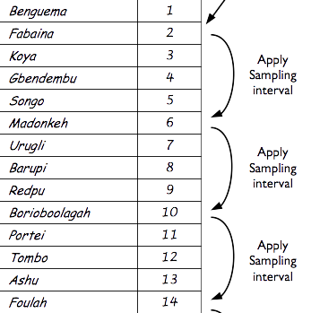

```{r setup, include=FALSE}
options(htmltools.dir.version = FALSE)
```

```{r xaringan-themer, include=FALSE, warning=FALSE}
library(xaringanthemer)
style_mono_light(
  #base_color = "#509935",
  base_color = "#000000",
  base_font_size = "22px",
  title_slide_background_color = "#FFFFFF",
  title_slide_background_image = "images/ecohealth_title_background_4by3.png",
  title_slide_background_size = "contain",
  #title_slide_text_color = "#509935",
  title_slide_text_color = "#000000",
  background_image = "images/ecohealth_slide_background_4by3.png",
  header_font_google = google_font("Fira Sans"),
  text_font_google = google_font("Fira Sans Condensed"),
  code_font_google = google_font("Fira Mono"),
  code_font_size = "0.7rem",
  text_slide_number_font_size = "1em",
  link_color = "#509935"
)
```

## Outline

* What are complex surveys?

* Concepts and principles of complex surveys 

    - Survey design
    - Survey analysis

* Using R for complex survey design and analysis

    - `{survey}` package
    - `{smartr}` package
    - `{bbw}` package

* Useful resources

---

## What are complex surveys?

* A population is specified; data values unknown but are fixed (not random);

* A random sample is drawn from the population. This is what we call the **sample design**;

* Given **sample design**, probabilities can be known/calculated;

* Analysis of complex survey samples aims to estimate features of the fixed population hence is a **design-based inference**.

---

## Complex survey design

* **Probability samples** or **random samples** - procedure for taking samples from a population and not just the data we happen to end up with. 

* **Probability samples** or **random samples** is a fundamental concept in design-based inference;

* Involves a sampling procedure that draws any subset of X number from the population with an equal likelihood of being selected.

---

## Complex survey design: simple random sample

* Drawing a sample of X number from a full list of members of a fixed population.

.pull-left[
Lottery


]

.pull-right[
Random number table


]

---

## Complex survey design: systematic sample

* Determine a **sampling interval**

$$ \text{sampling interval} ~ = ~ \left \lfloor \frac{\text{number of samples needed}}{\text{total number of population}} \right \rfloor $$

* Select a random number from the series of numbers between 1 and the sampling interval. This will be the **random starting point** for the systematic selection.

* Using the **random starting point** and the **sampling interval**, select the samples from a list of all members of the population starting from the random starting point position and then for every successive sampling interval position.

---

## Complex survey design: systematic sample

```{r, echo = FALSE, fig.align = "center"}

```

---

## Complex survey design: stratified random sample/clustered random sample

* Draw a simple random sample of Y number from each sub-grouping or strata or cluster of the population to get X number of sample from the total population; or,

* Draw a simple random sample of Z number from a simple random sample of Y number of sub-grouping or strata or cluster of the population to get X number of sample from the total population.

---

## Complex survey design: sample size

* Sample size estimation will be dictated by the complex survey design;

* Rule of thumb: A sample drawn via **simple random sample** will require smaller sample sizes compared to a sample drawn with stratification or clustering;

* Stratified and/or cluster samples often require some form of sample size inflation to account for loss of sampling variance due to increase homogeneity of samples from within a cluster.

---

## Complex survey analysis

* Complex survey analysis is shaped by the survey design;

* Analysis must factor in how the sample was drawn and the probabilities of a sample being selected;

* The probability of a sample being selected is called its **sampling weight**;

* The **sampling weight** is used to calibrate the contribution of sample to the overall outcome measure/indicator.

* Analysis that doesn't take into account survey design and **sampling weight** can potentially produce biased (inaccurate) results.

---

## Using R for complex survey analysis: `{survey}` package

* `{survey}` package authored and maintained by Thomas Lumley is the main R package that provides functions for implementing complex survey analysis;

* It can be installed from CRAN and loaded to R as follows:

```{r eval = FALSE}
install.packages("survey")
library(survey)
```

---

## Using R for complex survey analysis: `{survey}` package

* The typical workflow for complex survey analysis using the `{survey}` package is:

    - Describe the sample design to R and keep as an R object
    
    - Apply required analysis to the design-specified R object
    
---

## The `svydesign()` function

This is the main function that allows users to specify the sample design to R

```{r, eval = FALSE}
svydesign(
  ids,                   ## cluster identifieres
  probs = NULL,          ## cluster sampling probabilities
  strata = NULL,         ## strata specification
  variables = NULL,      
  fpc = NULL,            ## finite population correction
  data = NULL,           ## data
  nest = FALSE,          ## is data nested within strata?
  weights = NULL         ## sampling weights (alternative to probs)
)
```

---

## Example of an analysis on a simple random sample

```{r, message = FALSE, warning = FALSE}
library(survey)     # Load survey package
data(api)           # Load api dataset

## Describe simple random sample design
srs_design <- svydesign(ids = ~1, data = apisrs)

## Estimate the population mean of enrollees across the schools
svymean(~enroll, srs_design)
```

---

## Example of an analysis on a simple random sample

```{r, message = FALSE, warning = FALSE}
## Estimate the population total of enrollees across the schools
svytotal(~enroll, srs_design)

## Estimate the total number of different types of schools in California
svytotal(~stype, srs_design)
```
    
---

# Examples of an analysis on a stratified sample

```{r, message = FALSE, warning = FALSE}
## Describe stratified sample design
strat_design <- svydesign(ids = ~1, strata = ~stype, fpc = ~fpc, data = apistrat)

## Estimate the population mean of enrollees
svymean(~enroll, strat_design)
```

---

# Examples of an analysis on a stratified sample

```{r, message = FALSE, warning = FALSE}
## Estimate the population total of enrollees
svytotal(~enroll, strat_design)

## Estimate the total number of enrollees by school type
svytotal(~stype, strat_design)
```

---

# Useful resources

* Thomas Lumley's book *Complex Surveys: a guide to analysis using R*, published by Wiley.

* Thomas Lumley's accompaniment website for the Complex Surveys book - http://r-survey.r-forge.r-project.org/svybook/index.html

---

class: center, middle

# Thank you!

Slides can be viewed at https://ecohealthalliance.github.io/complexsurveys or PDF version downloaded at https://ecohealthalliance.github.io/complexsurveys/complexsurveys.pdf

R scripts for slides available at https://github.com/ecohealthalliance/complexsurveys
